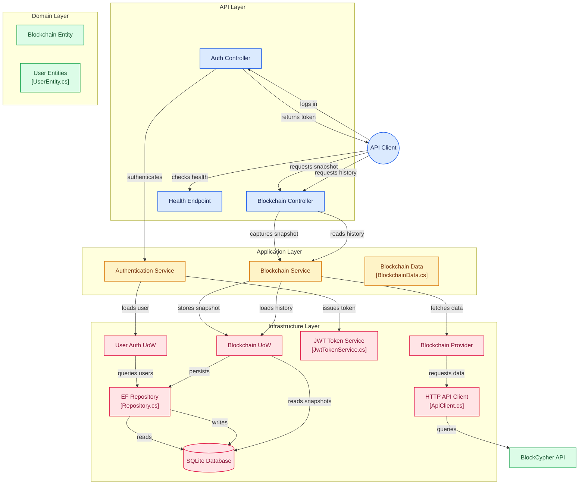

# Blockcypher API

## Overview

Blockcypher API is a .NET 8 REST API for retrieving and storing blockchain information using the BlockCypher API.

The application provides:
- Authentication using JWT.
- Retrieval of current blockchain data for supported coins and chains.
- Persistence of blockchain snapshots.
- Retrieval of historical blockchain data.

GitDiagram: <https://gitdiagram.com/gregopantelis/blockcypher> \
GitIngest: <https://gitingest.com/gregopantelis/blockcypher>

## Table of Contents

- [Overview](#overview)
- [Requirements](#requirements)
- [Getting Started](#getting-started)
  - [1. Repository Structure](#1-repository-structure)
  - [2. Clone the Repository](#1-clone-the-repository)
  - [3. Configure the Environment](#2-configure-the-environment)
  - [4. Run the Application](#3-run-the-application)
- [API](#api)
  - [Swagger](#swagger)
  - [Endpoints](#endpoints)
  - [Authentication](#authentication)
  - [Supported Blockchain Values](#supported-blockchain-values)
- [Architecture](#architecture)
  - [Diagram](#diagram)
  - [Project Structure](#project-structure)
- [Persistence](#persistence)
  - [Database Initialization](#database-initialization)
  - [Docker Persistence](#docker-persistence)
- [Testing](#testing)
  - [Test Structure](#test-structure)
- [Configuration](#configuration)
  - [Configuration Files](#configuration-files)
- [Logging](#logging)
- [Postman](#postman)

## Requirements

The application can be run using either Docker or the .NET SDK.

### Docker

- Docker
- Docker Compose

### .NET

- .NET 8 SDK

No external database installation is required. The application uses SQLite for persistence.

## Getting Started

### 1. Repository Structure

```text
Blockcypher/
├── src/
│   ├── API/
│   │   └── ICMarkets.Blockcypher.Api
│   │
│   ├── Application/
│   │   ├── ICMarkets.Blockcypher.Application.Configuration
│   │   ├── ICMarkets.Blockcypher.Application.DataObjects
│   │   ├── ICMarkets.Blockcypher.Application.DependencyInjection
│   │   ├── ICMarkets.Blockcypher.Application.Interfaces
│   │   └── ICMarkets.Blockcypher.Application.Services
│   │
│   ├── Domain/
│   │   ├── ICMarkets.Blockcypher.Domain.Entities
│   │   └── ICMarkets.Blockcypher.Domain.Types
│   │
│   └── Infrastructure/
│       ├── ICMarkets.Blockcypher.Infrastructure.Authentication
│       ├── ICMarkets.Blockcypher.Infrastructure.Configuration
│       ├── ICMarkets.Blockcypher.Infrastructure.DependencyInjection
│       ├── ICMarkets.Blockcypher.Infrastructure.ExternalApis
│       └── ICMarkets.Blockcypher.Infrastructure.Persistance
│
├── tests/
│   ├── UnitTests/
|   |   ├── ICMarkets.Blockcypher.Api.UnitTests
│   │   |── ICMarkets.Blockcypher.Application.UnitTests
│   │   └── ICMarkets.Blockcypher.Infrastructure.UnitTests
│   ├── IntegrationTests/
│   │   └── ICMarkets.Blockcypher.IntegrationTests
│   ├── FunctionalTests/
│   │   └── ICMarkets.Blockcypher.FunctionalTests
│   └── ICMarkets.Blockcypher.Tests.Shared
│
├── postman/
│   ├── Blockcypher.postman_collection.json
│   └── Blockcypher_Env.postman_environment.json
│
├── docker-compose.yml
├── run.sh
└── run.ps1
```

### 2. Clone the Repository

```bash
git clone "https://github.com/GregoPantelis/Blockcypher.git"
cd Blockcypher
```

### 3. Configure the Environment

Create a `.env` file in the repository root using `.env.example` as a template:

```bash
cp .env.example .env
```

Configure the following variables:

```env
ASPNETCORE_ENVIRONMENT=Development
INITIAL_USER_USERNAME=<username>
INITIAL_USER_PASSWORD=<password>
```

| Variable | Description |
| --- | --- |
| `ASPNETCORE_ENVIRONMENT` | Application environment, e.g. `Development` or `Production`. |
| `INITIAL_USER_USERNAME` | Username of the initial API user created during database initialization. |
| `INITIAL_USER_PASSWORD` | Password of the initial API user. |

The `.env` file contains environment-specific values and should not be committed to source control.

### 4. Run the Application

The repository provides startup scripts for both Linux and Windows. The scripts load the configuration from `.env` and automatically select an available runtime.

#### Linux

```bash
./run.sh
```

#### Windows

```powershell
.\run.ps1
```

By default, the scripts run in **auto** mode:

- Docker is used when Docker and Docker Compose are available.
- Otherwise, the application falls back to the .NET 8 SDK.

A specific runtime can be selected explicitly:

**Linux**

```bash
./run.sh docker
./run.sh dotnet
```

**Windows**

```powershell
.\run.ps1 docker
.\run.ps1 dotnet
```
 
| Option | Description |
| --- | --- |
| No option | Automatically selects Docker or .NET 8. |
| `docker` | Runs the application using Docker Compose. |
| `dotnet` | Runs the application directly using the .NET 8 SDK. |

Once started, the API is available at:

```text
http://localhost:8080
```

The health endpoint can be used to verify that the application is running:

```text
http://localhost:8080/health
```
## API

### Swagger

Swagger UI is available when the application is running in the `Development` environment and provides interactive documentation for all available API endpoints.

```text
http://localhost:8080/swagger
```

The OpenAPI specification is also available at:

```text
http://localhost:8080/swagger/v1/swagger.json
```

### Endpoints

All protected endpoints require a valid JWT access token using the `Bearer` authentication scheme.

| Method | Endpoint | Authentication | Description |
| --- | --- | --- | --- |
| `POST` | `/api/auth/login` | No | Authenticates a user and returns a JWT access token. |
| `POST` | `/api/blockchains/snapshot` | Yes | Retrieves and persists a snapshot of the current blockchain data. |
| `GET` | `/api/blockchains/{coin}/{chain}/history` | Yes | Retrieves previously persisted blockchain snapshots. |
| `GET` | `/health` | No | Provides the currect health status of the application |

### Authentication

Authenticate using the credentials configured in `.env`:

```http
POST /api/auth/login
Content-Type: application/json
```

```json
{
  "username": "<username>",
  "password": "<password>"
}
```

Protected endpoints require the returned token:

```http
Authorization: Bearer <token>
```

### Supported Blockchain Values

The `coin` and `chain` parameters determine which blockchain network is queried.

#### Coins

| Value | Blockchain |
| --- | --- |
| `btc` | Bitcoin |
| `ltc` | Litecoin |
| `eth` | Ethereum |
| `dash` | Dash |

#### Chains

| Value | Description |
| --- | --- |
| `main` | Main production blockchain network. |
| `test3` | Test blockchain network. |

The values are provided as route parameters:

```text
/api/blockchain/{coin}/{chain}
```

For example, to query the Bitcoin main network:

```text
/api/blockchain/btc/main
```

Or the Bitcoin test network:

```text
/api/blockchain/btc/test3
```

Not every coin necessarily supports every chain. The requested `coin` and `chain` combination must be supported by the underlying BlockCypher API.

## Architecture

The application follows **Clean Architecture**, separating business logic from external concerns and keeping dependencies directed toward the core of the application.

The solution is organized into four main layers:

```text
┌─────────────────────────────────────────┐
│                   API                   │
│        Controllers / HTTP / Startup     │
├─────────────────────────────────────────┤
│              Application                │
│     Services / Interfaces / DTOs        │
├─────────────────────────────────────────┤
│                 Domain                  │
│          Entities / Domain Types        │
├─────────────────────────────────────────┤
│             Infrastructure              │
│ Persistence / Auth / External APIs      │
└─────────────────────────────────────────┘
```

| Layer | Responsibility |
| --- | --- |
| **Domain** | Contains the core entities and domain types. It has no dependency on infrastructure or external systems. |
| **Application** | Contains application services, interfaces, DTOs and application logic. |
| **Infrastructure** | Provides implementations for persistence, authentication, external APIs and other technical concerns. |
| **API** | Exposes the application through REST endpoints and handles application startup and configuration. |

### Diagram



### Project Structure

```text
src/
├── API/
│   └── ICMarkets.Blockcypher.Api
│
├── Application/
│   ├── ICMarkets.Blockcypher.Application.Configuration
│   ├── ICMarkets.Blockcypher.Application.DataObjects
│   ├── ICMarkets.Blockcypher.Application.DependencyInjection
│   ├── ICMarkets.Blockcypher.Application.Interfaces
│   └── ICMarkets.Blockcypher.Application.Services
│
├── Domain/
│   ├── ICMarkets.Blockcypher.Domain.Entities
│   └── ICMarkets.Blockcypher.Domain.Types
│
└── Infrastructure/
    ├── ICMarkets.Blockcypher.Infrastructure.Authentication
    ├── ICMarkets.Blockcypher.Infrastructure.Configuration
    ├── ICMarkets.Blockcypher.Infrastructure.DependencyInjection
    ├── ICMarkets.Blockcypher.Infrastructure.ExternalApis
    └── ICMarkets.Blockcypher.Infrastructure.Persistance
```

The architecture follows the dependency inversion principle: application and domain logic depend on abstractions, while infrastructure provides their concrete implementations through dependency injection.

## Persistence

The application uses **SQLite** for data persistence and **Entity Framework Core** for database access.

Two database contexts are used:

- `BlockcypherDbContext` — stores blockchain snapshots and historical blockchain data.
- `UserAuthDbContext` — stores authentication and user data.

Both contexts use the same SQLite database while maintaining separate EF Core migration histories.

### Database Initialization

The database is initialized automatically when the application starts:

- The SQLite database is created if it does not exist.
- Pending EF Core migrations are applied automatically.
- The initial API user is seeded using the credentials configured in `.env`.

No manual database setup is required.

### Docker Persistence

When running with Docker, the SQLite database is stored in:

```text
/app/Data/blockcypher.db
```

A Docker named volume is used to persist the database between container restarts and recreations.

> Removing the Docker volume will also remove the persisted database.

## Testing

The solution includes **Unit**, **Integration**, and **Functional** tests to cover the different levels of the application.

| Test Type | Purpose |
| --- | --- |
| **Unit Tests** | Test individual components and application logic in isolation using mocks where required. |
| **Integration Tests** | Verify interactions between application components, persistence, authentication and API endpoints. |
| **Functional Tests** | Verify complete application workflows from an API consumer's perspective. |

### Test Structure

```text
tests/
├── UnitTests/
│   ├── ICMarkets.Blockcypher.Api.UnitTests
│   ├── ICMarkets.Blockcypher.Application.UnitTests
│   └── ICMarkets.Blockcypher.Infrastructure.UnitTests
│
├── IntegrationTests/
│   └── ICMarkets.Blockcypher.IntegrationTests
│
├── FunctionalTests/
│   └── ICMarkets.Blockcypher.FunctionalTests
│
└── ICMarkets.Blockcypher.Tests.Shared
```

Tests are implemented using **xUnit**. Integration and functional tests use isolated SQLite databases that are created and migrated automatically during test execution.

Run all tests from the repository root:

```bash
dotnet test
```

## Logging

The application uses **Serilog** for structured logging.

Logs are written to:

- Console logging
- Log location: `Logs/Blockcypher/`
- Rolled daily with 30-day retention

Logging levels and outputs are configured through `log.config`.

## Configuration

Application configuration is separated into environment-specific application settings, custom configuration and logging configuration.

### Configuration Files

| File | Purpose |
| --- | --- |
| `appsettings.json` | Base ASP.NET Core application settings. |
| `appsettings.{Environment}.json` | Environment-specific application settings. |
| `config.json` | Base application configuration, including database, external API and authentication settings. |
| `config.{Environment}.json` | Environment-specific overrides for application configuration. |
| `log.config` | Serilog logging configuration. |
| `.env` | Runtime environment variables and sensitive/local values. |

Environment-specific files are loaded according to `ASPNETCORE_ENVIRONMENT`.

For example:

```text
ASPNETCORE_ENVIRONMENT=Development

appsettings.json
    ↓
appsettings.Development.json

config.json
    ↓
config.Development.json
```

Environment variables can be used to override configuration values without modifying the configuration files.

Sensitive values, such as credentials and secrets, should be provided through environment variables and should not be committed to source control.

### Postman

A ready-to-use Postman collection and environment are included in the repository:

```text
postman/
├── Blockcypher.postman_collection.json
└── Blockcypher_Env.postman_environment.json
```

Import both files into Postman and select the `Blockcypher_Env` environment.

The collection contains the available API requests and uses environment variables for values such as the API base URL and JWT authentication token.

The authentication request automatically stores the returned JWT token in the environment for use by protected endpoints.
